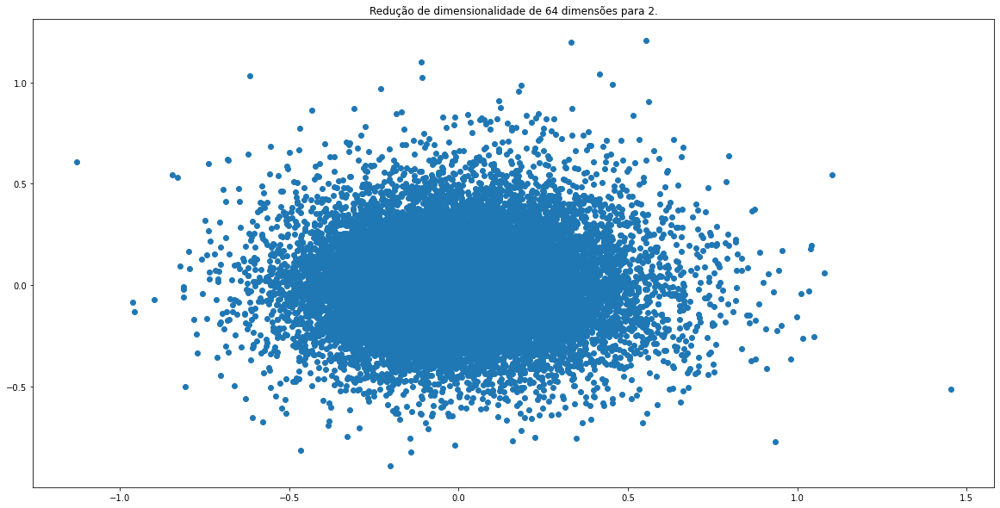

  
  
  
  


# Word-2-Vec

- Este repositório é uma treinamento/aprendizado da criação de word-embedding utilizando [Pytorch](https://pytorch.org/).

# Coleta de Dados

- No corpus, foram atodados mais de 3.000 artigos captados de uma fonte de informação [BBC](https://www.bbc.com/portuguese).  

- Inicialmente, foi criado um script que percorre por todas as páginas de cada subtema na página inicial da BBC e pegou-se os links que estão nelas. Para cada subtema foram pegos urls de todos artigos e salvos no arquivo [links.txt](links.txt).

- Depois de eliminados os links repetidos, para cada link foram pegos todos os parágrafos de cada artigo junto com seu título. Esse conteúdo foi salvo em cada arquivo individual na pasta [artigos](./artigos/). 

- **TODO O CONTEÚDO AQUI LISTADO NO DIRETÓRIO FOI PEGO NA PÁGINA DA [BBC](https://www.bbc.com/portuguese) no dia 23.05.2022**


# Escolha do modelo

- O script para criação da word-embedding está no arquivo [Word2Vec](word2vec.ipynb).  

- A escolha do algoritmo para treinamento e criação de **word-embedding** do corpus escohido foi um [CBOW](https://en.wikipedia.org/wiki/Bag-of-words_model#CBOW).

- O modelo então tem uma camada [embedding](https://pytorch.org/docs/stable/generated/torch.nn.Embedding.html) seguida de uma camada linear com N neurônios de saída, onde N representa o número de palavras distintas do corpus (depois de toda limpeza dos dados).  


# Treinamento

- Para o treinamento foram utilizados os seguintes parâmetros:  
```
    1. Learning Rate = 3e-2
    2. Batch size = 1024
    3. Números de palavras vizinhas a considerar (N_WINDOW) = 3
    4. Dimensão da word embedding = 64
    5. Retirada de stopwords = True
    6. Frequência mínima da palavra para considerar no vocabulário = 10
    7. Epocas = 50
```
- Para cada época do treinamento, foram salvos checkpoints do modelo e, neste caso, pegamos o último pois foi o que apresentou menor perda de treinamento.  

# Resultados

- No arquivo [analise_word_embedding.ipynb](./analise_word_embedding.ipynb) pode-se perceber alguns resultados interessantes. 

- Em primeiro lugar, no treinamento foi utilizado uma dimensão de ordem 64 para as word-embedding. Assim, para podermos visualizar num gráfico, devemos utilizar redução de dimensionalidade. Assim, foi usado o [PCA do Sklearn](https://scikit-learn.org/stable/modules/generated/sklearn.decomposition.PCA.html). 

- O resultado das palavras num gráfico 2d pode ser visto assim:  

  

- O problema é que quando buscamos a taxa de variância explicada dessas duas dimensões, o valor acumulado fica muito baixo:  
```
print (pca.explained_variance_ratio_)  
output: [0.03281898 0.02739503]  

print (pca.explained_variance_ratio_.sum())  
output: 0.06021401678715181
```  

- Ou seja, essas duas dimensões a que foram reduzidas representam apenas 6% as word-embedding. Assim, fazer uma comparação de distâncias entre esses pontos não seria algo correto. 

- Mas utilizando a [similaridade por coseno](https://pt.wikipedia.org/wiki/Similaridade_por_cosseno), através da função [cosine_similarity do sklearn](https://scikit-learn.org/stable/modules/generated/sklearn.metrics.pairwise.cosine_similarity.html), podemos utilizar todas as dimensões dos vetores e ver resultados interessantes. Alguns estão listados abaixo:  

```
Palavra: marrom
[('cinza', 0.465),
 ('grava', 0.462),
 ('distante', 0.45),
 ('visual', 0.443),
 ('bivar', 0.443),
 ('ilustracoes', 0.429),
 ('escuro', 0.427),
 ('louisiana', 0.421),
 ('analisar', 0.418),
 ('comercializar', 0.414)]
```

```
Palavra: utero
[('gemeos', 0.609),
 ('cobaias', 0.578),
 ('matam', 0.577),
 ('invasivo', 0.566),
 ('espontaneamente', 0.553),
 ('arrasta', 0.547),
 ('fisiologicas', 0.53),
 ('fisiologicos', 0.527),
 ('cancer', 0.522),
 ('produzir', 0.515)]
```

```
Palavra: venus
[('formacoes', 0.533),
 ('saturno', 0.512),
 ('perfeitos', 0.508),
 ('comunicar', 0.492),
 ('diametro', 0.486),
 ('dificilmente', 0.481),
 ('resolvendo', 0.473),
 ('funcao', 0.464),
 ('aprendizagem', 0.462),
 ('aereos', 0.46)]
```

```
Palavra: funcionar
[('adicionar', 0.547),
 ('algoritmo', 0.484),
 ('bug', 0.484),
 ('treinador', 0.483),
 ('qi', 0.483),
 ('k', 0.482),
 ('ampliando', 0.479),
 ('eolico', 0.47),
 ('exercitar', 0.467),
 ('escondidos', 0.465)]
```

```
Palavra: lutas
[('maria', 0.518),
 ('quaisquer', 0.459),
 ('areia', 0.448),
 ('comemoracoes', 0.437),
 ('unida', 0.431),
 ('vicente', 0.421),
 ('revoltas', 0.41),
 ('mentiu', 0.409),
 ('interacao', 0.397),
 ('representacoes', 0.397)]
```

```
Palavra: viver
[('agitada', 0.554),
 ('apaixonada', 0.524),
 ('conhecer', 0.514),
 ('excelente', 0.506),
 ('millennial', 0.505),
 ('genitais', 0.503),
 ('maluco', 0.5),
 ('joinville', 0.481),
 ('lembre', 0.477),
 ('sentir', 0.474)]
```

# Conclusão

- Com certeza pode-se melhorar muito o resultado obtido nesse aprendizado, seja aumentando o tamanho do corpus quanto fazendo uma busca dos melhores hiperparâmetros do nosso algoritmo, aumentando/diminuindo o tamanho da dimensão dos vetores, escolhendo n_window maior/menor etc. 